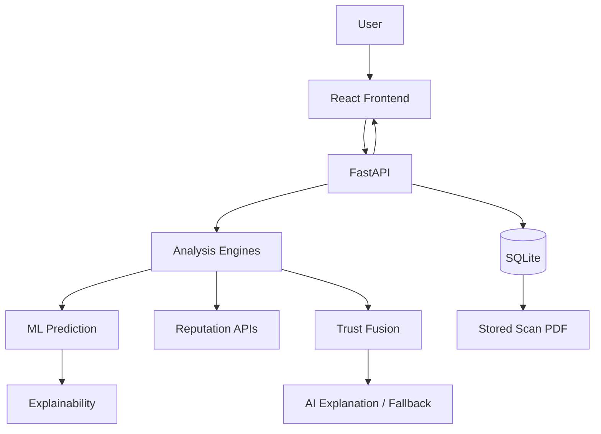

# TrustShield AI — System Architecture

The scan endpoint validates before network access, combines independent evidence into the existing TrustShield score, stores the completed payload for history/report export, and returns the structured result needed by the frontend.
